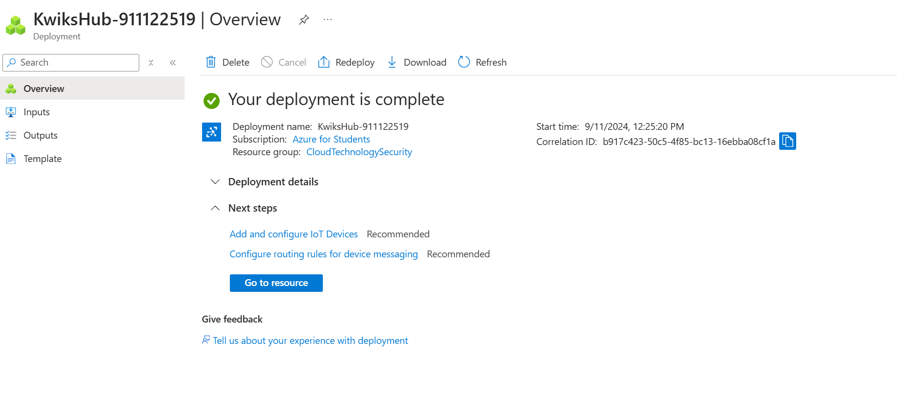
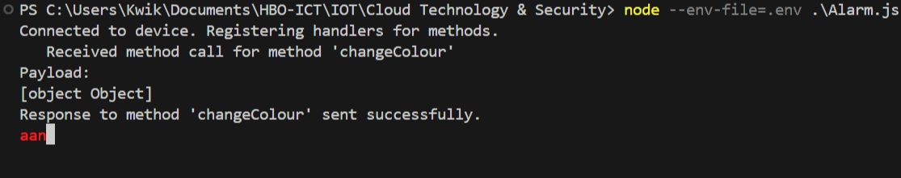
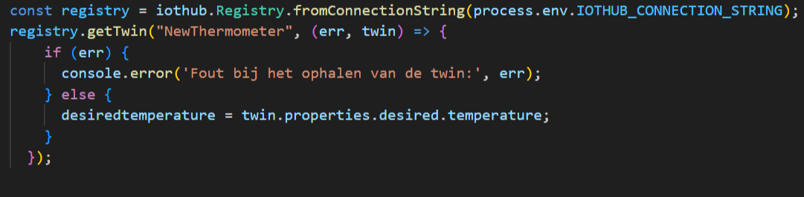

# Opdracht 3 Cloud Technology & Security
**Qing Scholten (20208294)**

## Voorbereiding
1. De IOT Hub is succesvol aangemaakt.

## Practicum opgave
1. De device is succesvol aangemaakt.

---
3. az iot hub monitor-events --output table -p all -n KwiksHub
   
   
   
   Het bericht is afkomstig van NewDevice. Dit is consistent.
   
---
4. De vier events zijn 'connect', 'error', 'disconnect' en 'message'. Deze vier hebben een handler in het NewDevice voorbeeld. In de vorige vraag is het 'connect' event gebruikt. 
---
5. 

   
   
---
6. 

   
   
   
---
7. 
   
    
---
9. De methodes "getDeviceLog" en "lockDoor".
---
10. 

    
---
11. 

    
---
12. 

    
---
13. 

---
14. 

---
16. De naam, de tags, connectiestatus, update tijd, laatste activiteit, authenticatietype, versie en laatste update.
---
17.  Het programma simuleert een termometer met een desired temperatuur ingesteld op 20 graden. Het programma stuurt een waarschuwing als het kouder wordt dan de desired temperatuur.

