# Opdracht 4
## Cloud Technology & Security
### Qing Scholten
---
## Opdracht 1: Http trigger function
1. 
```
const { app } = require('@azure/functions');

app.http('Function2', {
    methods: ['GET', 'POST'],
    authLevel: 'anonymous',
    handler: async (request, context) => {
        context.log(`Http function processed request for url "${request.url}"`);

        const parameter = request.query.get('parameter');
        if (parameter === null) {
            context.log("Error! Parameter ontbreekt!");
            return {
                status: 500,
                body: "Error! Je hebt parameter niet meegegeven!"
            }
        }
        return { body: `Hello, je parameter is ${parameter}!` };
    }
});
```
2. Het await keyword is aanwezig omdat het proces asynchroon de gegevens van het HTTP-verzoek inleest. Het voert de functie pas uit als de benodigde data binnen is. Door de asynchrone functionaliteit blijft de server efficiënt werken zonder dat het geblokkeerd wordt doordat het wacht op data.
3. 
- az login
- az group create --name Practicum4 --location westeurope
- az storage account create --name practicum4 --location westeurope --resource-group Practicum4 --sku Standard_LRS --allow-blob-public-access false
- az functionapp create --resource-group Practicum4 --consumption-plan-location westeurope --runtime node --runtime-version 20 --functions-version 4 --name practicum4 --storage-account practicum4
- func azure functionapp publish practicum4
De logmeldingen verschijnen in de cli nadat de command "func azure functionapp logstream practicum4" ingevoerd is.
4. Iedereen op het internet met de URL van de site waar de functie aan vast zit.
---
## Opdracht 2: REST api met azure function
1. 
```
const { app } = require('@azure/functions');

app.http('PersonenLijst', {
    methods: ['GET'],
    authLevel: 'anonymous',
    handler: async (request, context) => {
        context.log(`Http function processed request for url "${request.url}"`);

        const jsonlist = {Personen: 
            [{Naam: "Kwak"},
            {Naam: "Kwik"}]};
        const textlist = JSON.stringify(jsonlist);

        return { body: `Hello, ${textlist}!` };
    }
});
```
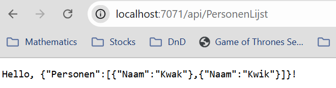

2.

```
const { app } = require('@azure/functions');

app.http('PersonenLijst', {
    methods: ['GET'],
    authLevel: 'anonymous',
    route: 'personen/{id:int?}',
    handler: async (request, context) => {
        context.log(`Http function processed request for url "${request.url}"`);

        var id = request.params.id - 1;
        const jsonlist = {Personen: 
            [{Naam: "Kwak"},
            {Naam: "Kwik"},
            {Naam: "Kwek"}]};
        const persoon = jsonlist.Personen[id];
        if (isNaN(id)) {
            var textlist = JSON.stringify(jsonlist);
        }
        else if (id > jsonlist.Personen.length-1) {
            var textlist = "Deze persoon bestaat niet!";
        }
        else {
            var textlist = JSON.stringify(persoon);
        }
        return { body: `${textlist}` };
    }
});
```
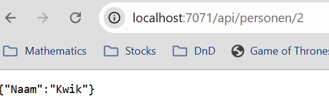

3.

```
const { app } = require('@azure/functions');
const jsonlist = {Personen: 
    [{Naam: "Kwak"},
    {Naam: "Kwik"},
    {Naam: "Kwek"}]};

app.http('PersonenLijst', {
    methods: ['GET'],
    authLevel: 'anonymous',
    route: 'personen/{id:int?}',
    handler: async (request, context) => {
        context.log(`Http function processed request for url "${request.url}"`);

        var id = request.params.id - 1;
        var persoon = jsonlist.Personen[id];
        if (isNaN(id)) {
            context.log(`Verzoek tot opvragen gehele personenlijst.`)
            var textlist = JSON.stringify(jsonlist);
        }
        else if (id > jsonlist.Personen.length || id < 0) {
            context.log(`Verzoek tot opvragen van niet bestaand persoon!`)
            return {
                status: 404,
                body: "404! Deze persoon bestaat niet!"
            }
        }
        else {
            context.log(`Verzoek tot opvragen van persoon ${id}.`)
            var textlist = JSON.stringify(persoon);
        }
        return { body: `${textlist}` };
    }
});

```
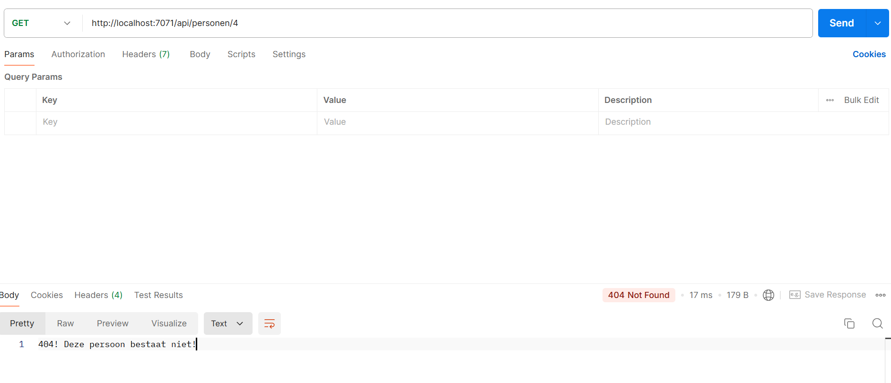

4. 

```
app.http('PersonenToevoegen', {
    methods: ['POST'],
    authLevel: 'anonymous',
    route: 'personen',
    handler: async (request, context) => {
        context.log(`HTTP function processed request for url "${request.url}"`);
        try {
            var naam = request.query.get('naam');
            if (naam === null) {
                context.log("Poging tot toevoeging persoon zonder naam.")
                return {
                    status: 404
                }
            }
            else {
                var nieuwpersoon = {Naam: naam};
                jsonlist.Personen.push(nieuwpersoon);
                context.log(`Persoon toegevoegd: ${JSON.stringify(nieuwpersoon)}`)
            }

            return {body: `Persoon succesvol toegevoegd: ${JSON.stringify(nieuwpersoon)}`};
        }
        catch (e) {
            context.log(`Fout bij het verwerken van het toevoegen van een persoon`, e);
            return {
                status: 500,
                body: 'Interne serverfout bij toevoegen van persoon.'
            }
        }
    }
});
```
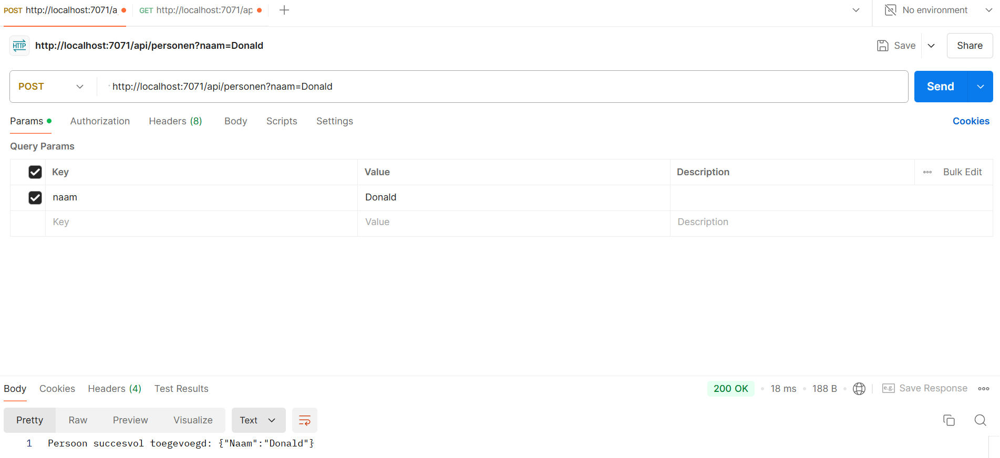
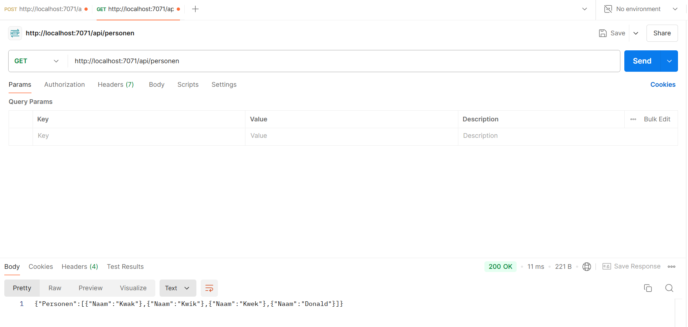

5.

```
app.http('PersonenAanpassen', {
    methods: ['PUT'],
    authLevel: 'anonymous',
    route: 'personen/{id:int?}',
    handler: async (request, context) => {
        context.log(`HTTP function processed request for url "${request.url}"`);
        try {
            var id = request.params.id - 1;
            if (isNaN(id) || id > jsonlist.Personen.length || id < 0) {
                context.log(`Poging tot wijzigen van niet bestaand persoon.`)
                return {
                    status: 400,
                    body: 'Persoon met dit id bestaat niet.'
                }
            }
            var naam = request.query.get('naam');
            if (naam == null) {
                context.log("Poging tot verandering persoon zonder naam.")
                return {
                    status: 400,
                    body: 'Geen naam ingegeven.'
                }
            }
            else {
                var nieuwpersoon = {Naam: naam};
                jsonlist.Personen[id] = nieuwpersoon;
                context.log(`Persoon aangepast: ${JSON.stringify(nieuwpersoon)}`);
                return {
                    status: 200
                }
            }
        }
        catch (e) {
            context.log(`Fout bij het verwerken van het veranderen van een persoon`, e);
            return {
                status: 500,
                body: 'Interne serverfout bij veranderen van persoon.'
            }
        }
    }
});
```

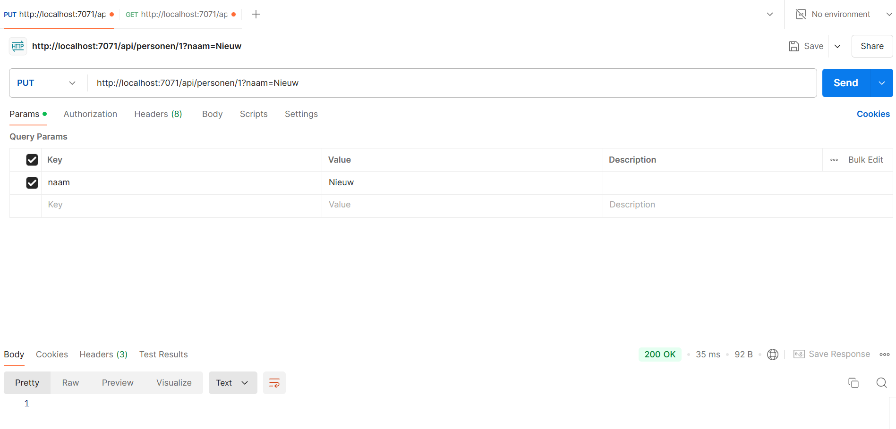
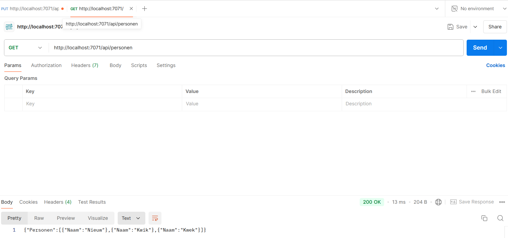

6.

```
app.http('PersonenVerwijderen', {
    methods: ['DELETE'],
    authLevel: 'anonymous',
    route: 'personen/{id:int?}',
    handler: async (request, context) => {
        context.log(`HTTP function processed request for url "${request.url}"`);
        try {
            var id = request.params.id - 1;
            if (isNaN(id) || id > jsonlist.Personen.length || id < 0) {
                context.log(`Poging tot verwijderen van niet bestaand persoon.`)
                return {
                    status: 400,
                    body: 'Persoon met dit id bestaat niet.'
                }
            }
            else {
                var verwijderpersoon = jsonlist.Personen[id];
                jsonlist.Personen.splice(id,1);
                context.log(`Persoon verwijderd: ${JSON.stringify(verwijderpersoon)}`);
                return {
                    status: 200
                }
            }
        }
        catch (e) {
            context.log(`Fout bij het verwerken van het verwijderen van een persoon`, e);
            return {
                status: 500,
                body: 'Interne serverfout bij verwijderen van persoon.'
            }
        }
    }
});
```
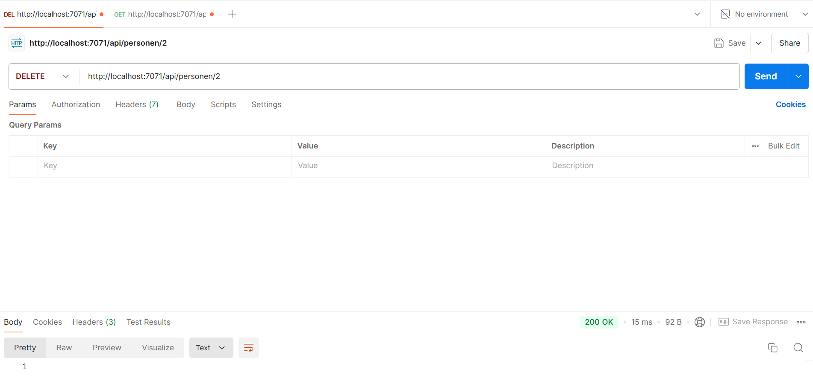


7.

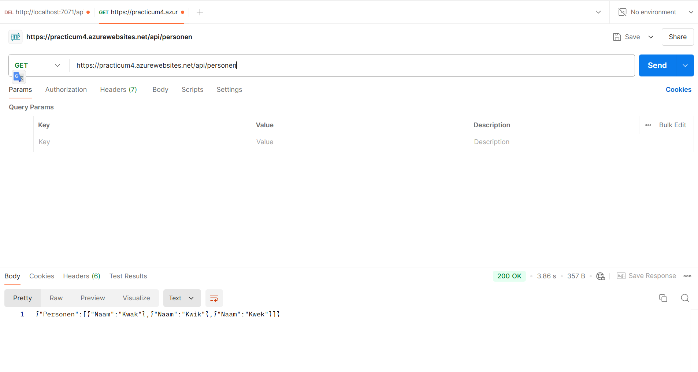
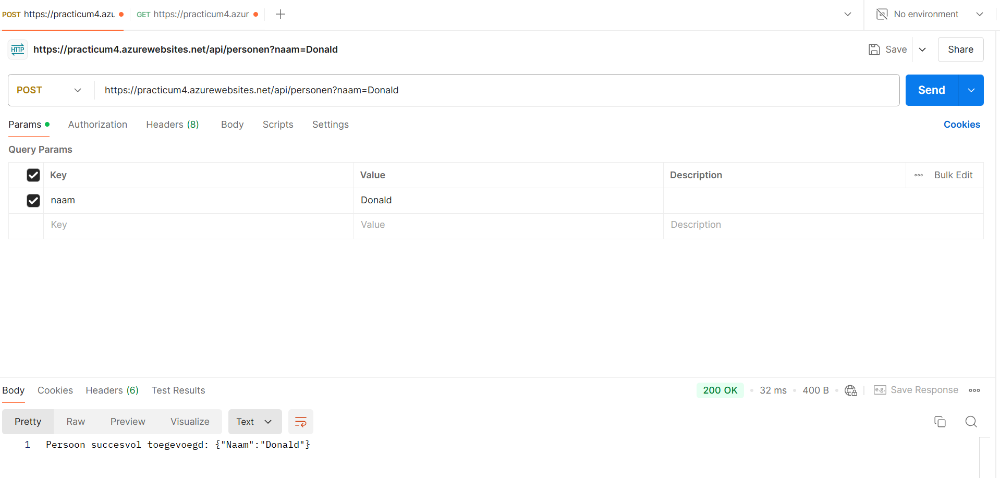
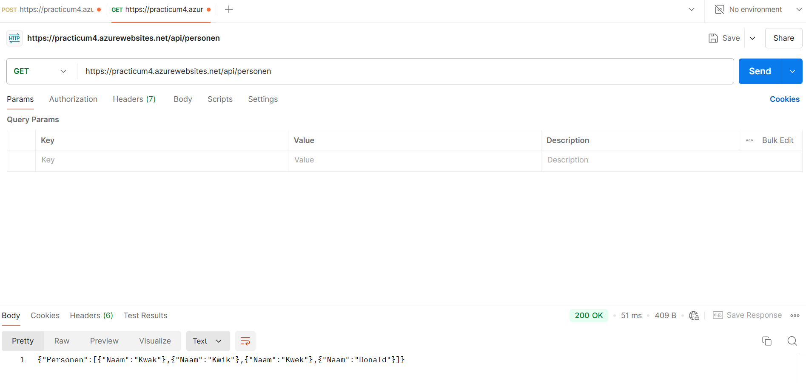
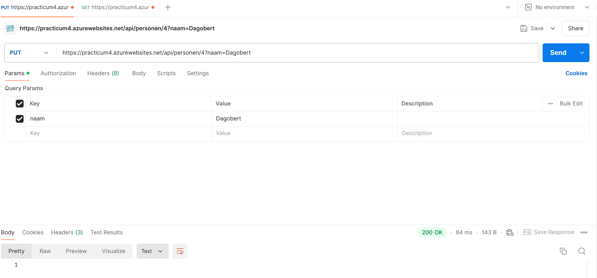
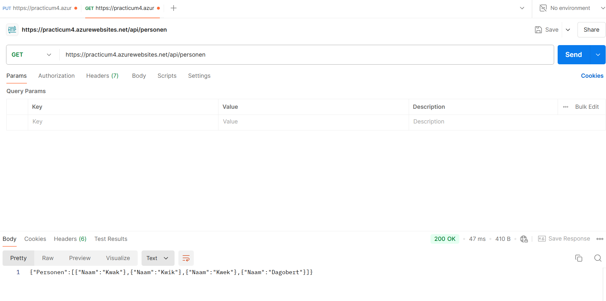
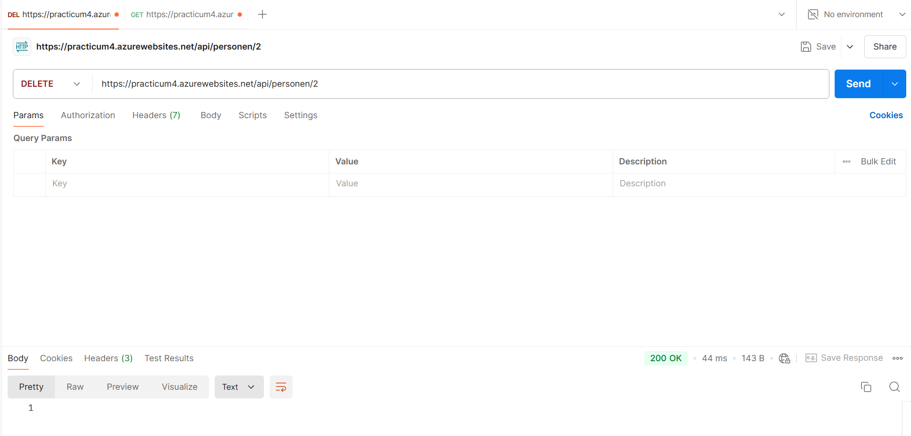
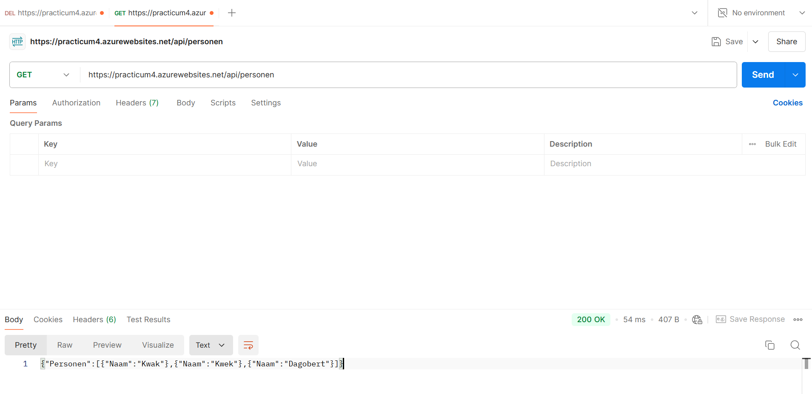

8. Door de authorization level te veranderen van 'anonymous' naar 'function' of 'admin' is er een specifieke key nodig om de API te kunnen gebruiken. 

9. Er is een parameter "code" toegevoegd in de link die gebruikt wordt voor het GET request.

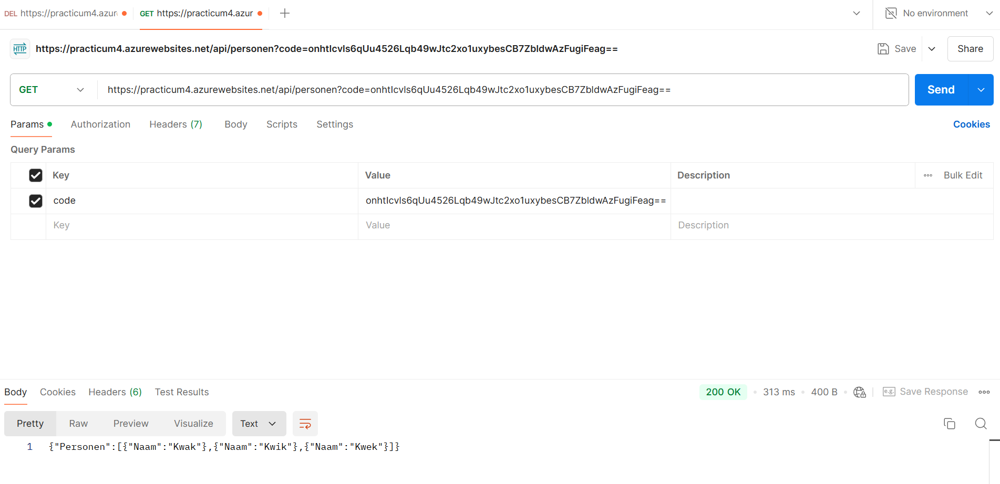