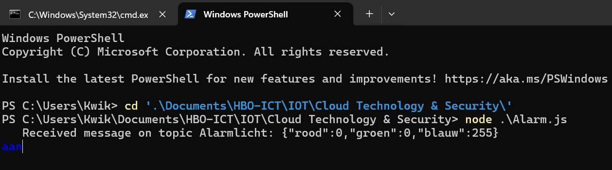

# Opdracht 5
## Cloud Technology & Security
### Qing Scholten
---
## Opdracht 1: Function met mqtt publish
1. 
```js
const { app } = require('@azure/functions');

app.http('MQTTPublish', {
    methods: ['POST'],
    authLevel: 'anonymous',
    handler: async (request, context) => {
        const mqtt = require("mqtt");
        const client = mqtt.connect("mqtt:broker.mqttdashboard.com");
        var publishtopic = "Alarmlicht";

        context.log(`Http function processed request for url "${request.url}"`);

        let text = "Test";
        client.publish(publishtopic, text);

        return { body: `Publish is verzonden: ${text}!` };
    }
});
```
 

2.
```js
app.http('AlarmAansturing', {
    methods: ['PUT'],
    authlevel: 'anonymous',
    route: 'alarm/{id:int?}',
    handler: async (request, context) => {
        const mqtt = require("mqtt");
        const client = mqtt.connect("mqtt:broker.mqttdashboard.com");
        var publishtopic = "Alarmlicht";

        context.log(`Http function processed request for url "${request.url}"`);

        try {
            var id = request.params.id;
            if (id == 1) {
                var bod = await request.json();
                var text = JSON.stringify(bod);
                client.publish(publishtopic, text);
                return {
                    status: 200
                }
            }
            else {
                return {
                    status: 404,
                    body: `Alarm met ID ${id} bestaat niet.`
                }
            }
        }
        catch (e) {
            context.log(`Fout bij het aansturen van het alarm`, e);
            return {
                status: 500,
                body: 'Interne serverfout bij aansturen van alarm.'
            }
        }
    }
});
```


3. 
```js
app.http('AlarmAansturing', {
    methods: ['PUT'],
    authlevel: 'anonymous',
    route: 'alarm/{id:int?}',
    handler: async (request, context) => {
        const mqtt = require("mqtt");
        const client = mqtt.connect("mqtt:broker.mqttdashboard.com");
        const alarmlichten = ["Alarmlicht", "Alarmlicht2"]
        var publishtopic = "Alarmlicht";

        context.log(`Http function processed request for url "${request.url}"`);

        try {
            var id = request.params.id - 1;
            if (id < alarmlichten.length) {
                var bod = await request.json();
                var text = JSON.stringify(bod);
                client.publish(alarmlichten[id], text);
                return {
                    status: 200
                }
            }
            else {
                return {
                    status: 404,
                    body: `Alarm met ID ${id} bestaat niet.`
                }
            }
        }
        catch (e) {
            context.log(`Fout bij het aansturen van het alarm`, e);
            return {
                status: 500,
                body: 'Interne serverfout bij aansturen van alarm.'
            }
        }
    }
});
```



4. 


## Opdracht 2: Await en Async in node.js
5. 
```js
var fs = require ('fs');
fs.readFile('file.txt', function(e, data) {
    if (e) {
        console.log(`Error bij het lezen van bestand: ${e}`);
        return;
    }
    else {
        console.log(`Bestandsinhoud: ${data}`);
        return;
    }
});
console.log("Hey Ho");
```


6.
```js
async function ReadFile() {
    var fs = require ('fs/promises');
    try {
        const data = await fs.readFile('file.txt');
        console.log(`Bestandsinhoud: ${data}`);
    }
    catch (e) {
        console.log(`Error bij het lezen van bestand: ${e}`);
    }
}

ReadFile();
console.log("Hey Ho")
```


7.
```js
app.http('LeesBestand', {
    methods: ['GET'],
    authlevel: 'anonymous',
    route: 'leesbestand',
    handler: async (request, context) => {
        async function ReadFile() {
            var fs = require ('fs/promises');
            try {
                const data = await fs.readFile('package.json');
                console.log(`Bestandsinhoud: ${data}`);
            }
            catch (e) {
                console.log(`Error bij het lezen van bestand: ${e}`);
            }
        }
        
        ReadFile();
        console.log("Hey Ho")
    }
})
```


## Opdracht 3: Azure Iot hub en functio 
8. 

```js
app.http('AlarmIOT', {
    methods: ['PUT'],
    authLevel: 'anonymous',
    route: 'alarm2/{id:int?}',
    handler: async (request, context) => {
        var Client = require('azure-iothub').Client;
        var connectionString = process.env.IOTHUB_CONNECTION_STRING;
        var client = Client.fromConnectionString(connectionString);
        context.log(`Http function processed request for url "${request.url}"`);

        try {
            var id = request.params.id;
            if (id == 1) {
                var bod = await request.json();
                var text = JSON.stringify(bod);
                text = JSON.parse(text);
                var methodParams = {
                    methodName: text.method,
                    payload: text.payload,
                    responseTimeoutInSeconds: 15
                }
                var targetDevice = "NewAlarm";
                client.invokeDeviceMethod(targetDevice, methodParams, function (err, result) {
                    if (err) {
                        console.error('Failed to invoke method \'' + methodParams.methodName + '\': ' + err.message);
                    }
                    else {
                        console.log(methodParams.methodName + ' on ' + targetDevice + ':');
                        console.log(JSON.stringify(result, null, 2));
                    }
                })
                return {
                    status: 200
                }
            }
            else {
                return {
                    status: 404,
                    body: `Alarm met ID ${id} bestaat niet.`
                }
            }
        }
        catch (e) {
            context.log(`Fout bij het aansturen van het alarm`, e);
            return {
                status: 500,
                body: 'Interne serverfout bij aansturen van alarm.'
            }
        }
    }
});
```


9. 
```js
var alarms = {
    "Alarms": [
        {
            "Method": "MQTT",
            "Name": "Alarmlicht"
        },
        {
            "Method": "Azure",
            "Name": "NewAlarm"
        }
    ]
}

app.http('AlarmAzureIOT', {
    methods: ['PUT'],
    authLevel: 'anonymous',
    route: 'alarm/{id:int?}',
    handler: async (request, context) => {
        var Client = require('azure-iothub').Client;
        var connectionString = process.env.IOTHUB_CONNECTION_STRING;
        var client = Client.fromConnectionString(connectionString);
        context.log(`Http function processed request for url "${request.url}"`);
        try {
            var id = request.params.id - 1;
            if (id < alarms.Alarms.length) {
                var bod = await request.json();
                var text = JSON.stringify(bod);
                text = JSON.parse(text);
                if (alarms.Alarms[id].Method === "MQTT"){
                    const mqtt = require("mqtt");
                    const clientmqtt = mqtt.connect("mqtt:broker.mqttdashboard.com");
                    var temptext = JSON.stringify(bod);
                    clientmqtt.publish(alarms.Alarms[id].Name, temptext);
                    return {
                        status: 200
                    }
                }
                else if (alarms.Alarms[id].Method === "Azure") {
                var methodParams = {
                    methodName: "change",
                    payload: text.payload,
                    responseTimeoutInSeconds: 15
                }
                    client.invokeDeviceMethod(alarms.Alarms[id].Name, methodParams, function (err, result) {
                        if (err) {
                            console.error('Failed to invoke method \'' + methodParams.methodName + '\': ' + err.message);
                        }
                        else {
                            console.log(methodParams.methodName + ' on ' + targetDevice + ':');
                            console.log(JSON.stringify(result, null, 2));
                        }
                    })
                }
                else {
                    return {
                        status: 500,
                        body: 'Interne serverfout bij aansturen van alarm.'
                    }
                }
            }
            else {
                return {
                    status: 404,
                    body: `Alarm met ID ${id} bestaat niet.`
                }
            }
        }
        catch (e) {
            context.log(`Fout bij het aansturen van het alarm`, e);
            return {
                status: 500,
                body: 'Interne serverfout bij aansturen van alarm.'
            }
        }
    }
});
```


10. Omdat je nu een universele aansturing hebt voor verschillende soorten systemen, in dit geval Alarm systemen. Nu is de client niet meer afhankelijk van de implementatie van de verschillende alarm systemen (MQTT aangestuurd en Azure aangestuurd).
11. 

```js
app.http('AlarmGET', {
    methods: ['GET'],
    authLevel: 'anonymous',
    route: 'alarm/{id:int?}',
    handler: async (request, context) => {
        context.log(`Http function processed request for url "${request.url}"`);

        var id = request.params.id - 1;
        var al = alarms.Alarms[id];
        if (isNaN(id)) {
            context.log(`Verzoek tot opvragen gehele alarmlijst.`);
            var textlist = JSON.stringify(alarms);
        }
        else if (id > alarms.Alarms.length || id < 0) {
            context.log(`Verzoek tot opvragen van niet bestaand alarm!`)
            return {
                status: 404,
                body: "404! Dit alarm bestaat niet!"
            }
        }
        else {
            context.log(`Verzoek tot opvragen van alarm ${id}.`)
            var textlist = JSON.stringify(al);
        }
        return { 
            status: 200,
            body: `${textlist}` };
    }
})

app.http('AlarmToevoegen', {
    methods: ['Post'],
    authLevel: 'anonymous',
    route: 'alarm',
    handler: async (request, context) => {
        context.log(`Http function processed request for url "${request.url}"`);
        try {
            var bod = await request.text();
            var nieuwalarm = JSON.parse(bod);
            if (!nieuwalarm.hasOwnProperty("Method")) {
                context.log("Poging tot toevoeging alarm zonder methode van communicatie.");
                return {
                    status: 404,
                    body: "Een alarm kan niet toegevoegd worden zonder methode van communicatie."
                }
            }
            else if (!nieuwalarm.hasOwnProperty("Name")) {
                context.log("Poging tot toevoeging alarm zonder naam.");
                return {
                    status: 404,
                    body: "Een alarm kan niet toegevoegd worden zonder naam."
                }
            }
            else {
                alarms.Alarms.push(nieuwalarm);
                context.log(`Alarm toegevoegd: ${JSON.stringify(nieuwalarm)}`);
                return{
                    status: 200,
                    body: `Alarm succesvol toegevoegd: ${JSON.stringify(nieuwalarm)}` 
                }
            }
        }
        catch (e) {
            context.log(`Fout bij het verwerken van het toevoegen van een alarm`, e);
            return {
                status: 500,
                body: 'Interne serverfout bij toevoegen alarm.'
            }
        }
    }
});
```


12.

```js
app.http('DeurAansturing', {
    methods: ['PUT'],
    authLevel: 'anonymous',
    route: 'deur/{id:int?}',
    handler: async (request, context) => {
        var Client = require('azure-iothub').Client;
        var connectionString = process.env.IOTHUB_CONNECTION_STRING;
        var client = Client.fromConnectionString(connectionString);
        context.log(`Http function processed request for url "${request.url}"`);
        try {
            var id = request.params.id - 1;
            if (id < deuren.Deuren.length) {
                var bod = await request.json();
                var text = JSON.stringify(bod);
                text = JSON.parse(text);
                var methodParams = {
                    methodName: "changeStatus",
                    payload: text.payload,
                    responseTimeoutInSeconds: 15
                }
                console.log(deuren.Deuren[id].Name);
                var result = await client.invokeDeviceMethod(deuren.Deuren[id].Name, methodParams);
                console.log(result.result);
                return {
                    status: 200,
                    body: JSON.stringify(result.result)
                }
            }
            else {
                return {
                    status: 404,
                    body: `Deur met ID ${id+1} bestaat niet.`
                }
            }
        }
        catch (e) {
            context.log(`Fout bij het aansturen van de deur`, e);
            return {
                status: 500,
                body: 'Interne serverfout bij aansturen van deur.'
            }
        }
    }
});

```


